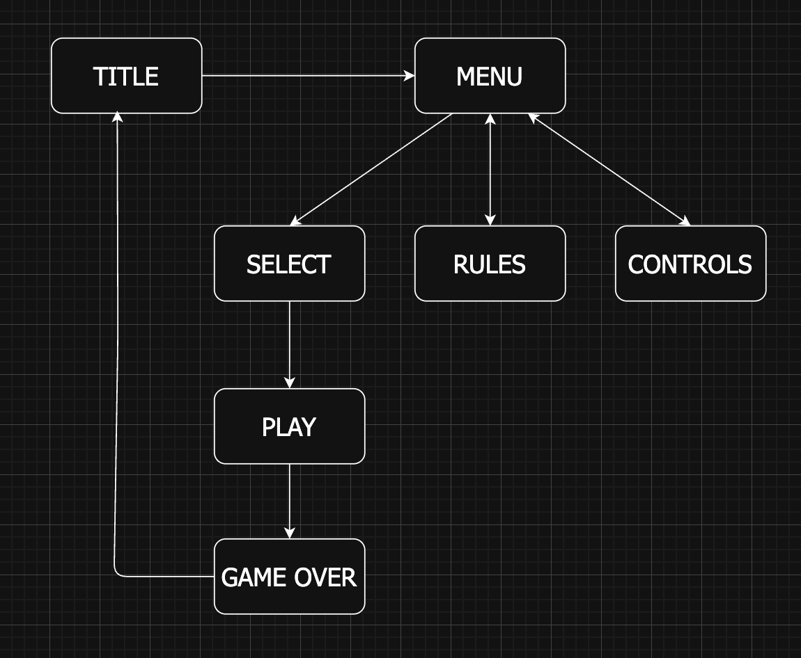

 

  <b>Play Here: <a href="https://ericpaulin.github.io/snake-game/">Snake</a> 🐍🐍🐍</b>

 

 
Snake is a <b>Lightweight Vanilla TypeScript </b> game about a hungry snake eating apples. I wanted to make my own version that was responsive and used the original Game Boy’s color palette so when you played it on a phone it emulated the look of playing on an original Game Boy. The original version was made using HTML, CSS, and JavaScript but has more recently moved to TypeScript. All pixel art and animations were made using Aseprite. The gameplay loop is the classic snake formula of eating apples, raising your score, and avoiding the walls of death. To make it more fun I added poison apples that damage / kill the player and lower their score, but also three playable characters (two need to be unlocked via a high score) with different stats and designs to keep the game fun.

 

## FEATURES
 - Snake Gameplay Loop (eat, grow)
 - Local Storage (saves high score + unlocked characters)
 - Retro UI, Custom Sprites + Animation
 - Unlockable Characters

<b>Tech Stack:</b>  HTML, CSS, TypeScript, Node.js

<b>Core Concepts:</b> ESModules, Queues, System Architecture, Game Logic, Color Theory, Pixel Art, Animation, UI/UX, State Machines, Open Source

 

## Local Development
This is an open source snake game clone. Because of this you're free to use and modify it as you please. To get the code running locally on your own machine using Visual Studio Code you just need to do the following steps:
1. Clone the Repository
2. Install TypeScript globally: `npm install -g typescript`
3. Start the compiler (in watch mode): `tsc -w`
4. Launch the local server using the **Live Server** extension via Visual Studio Code

 

## Changelog
#### Version 1.0
- Core Gameplay Loop Established
- 3 Unlockable Characters
- Local Storage (saves)

#### Version 1.1 (Current Version)
- MENU, RULES, and CONTROLS screens added
- Poison Apple Obstacle added (hurts snake, lowers score, raises speed)
- Transitioned Codebase from JavaScript to TypeScript + added Node.js
- Moved from single script file to multiple ESModules (readability + decoupled architecture)
- State Machine added for Screens
- Bug Fixes

 

 
 
<i>Finite State Machine for menu transitions and gameplay states.</i>

 

## Challenges and Solutions

The original build of 'Snake' was seeing if I could build a snake game clone in a week. It was a thrill to do and I learned a lot about how web-based browser games work and how to make them responsive (UI and controls). This time around (a year later) I wanted to see how much I've grown as a developer by updating its codebase and focusing more on its system architecture to make it easily scalable for open source usage. The first big thing I wanted to do was move the codebase away from JavaScript and make it entirely TypeScript for static typing but also so I could use unions to make State Machines revolving around the different screens the user sees. I also liked how lightweight the original was, so I kept it vanilla and didn't add any external frameworks and relied purely on the core features of ESModules and TypeScript. This was a bit of a learning curve for me, but the official TypeScript documentation helped me out a ton. In the process of converting my code I also realized how bloated and unreadable the entire thing was, so I decoupled it into multiple files consisting of their core functionality (display, controls, game-logic, and characters) and added comments for further readability. Finally I wanted to add a new gameplay feature because I felt the game could be more fun, but also I wanted to test firsthand if my new code architecture was more cohesive and easier to use than my old one. I decided to add two things: new screens and the poison apple. The new screens were added to see if using unions as a state machine was as seamless as I thought. I also added screens because I felt the original lacked any direction, so adding a main menu with rules and controls made for a better user experience. Finally the poison apple was added to expand on the queue data structure logic and as a new obstacle for the player to make the game more exciting.

